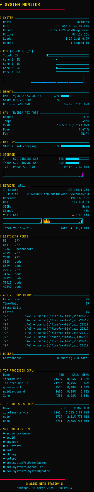

<div align="center">

# ⚡ Nerd System Monitor

**Sistema de monitoramento e gerenciamento para Linux**

[](https://pop.system76.com/)
[](https://www.gnome.org/)
[](LICENSE)
[](#)

Widget Conky no desktop + painéis interativos via Rofi para gerenciar processos, Docker e serviços systemd.

<br>

### 🎬 Demo



<sub>Widget Conky rodando no desktop — monitoramento de CPU, RAM, GPU, rede, Docker, processos e serviços em tempo real.</sub>

</div>

---

## 📋 Índice

- [Funcionalidades](#-funcionalidades)
- [Dependências](#-dependências)
- [Instalação](#-instalação)
- [Atalhos de Teclado](#️-atalhos-de-teclado)
- [Estrutura do Projeto](#-estrutura-do-projeto)
- [Licença](#-licença)

---

## ✨ Funcionalidades

### 🖥️ Conky Widget (Desktop)

Monitoramento em tempo real diretamente no desktop:

| Módulo | Informações |
|--------|-------------|
| **CPU** | Uso por core, frequência, temperatura, gráfico |
| **RAM/SWAP** | Uso, buffers, cache |
| **GPU** | NVIDIA: uso, VRAM, temperatura, fan, power |
| **Bateria** | Status, porcentagem, barra visual |
| **Armazenamento** | Uso `/` e `/home`, I/O read/write, gráfico |
| **Rede** | IP local/público, gateway, DNS, SSID, signal, velocidade ▼▲ |
| **Portas** | Listening ports com processo associado |
| **Conexões** | Established, time-wait, close-wait, listen |
| **Docker** | Containers running/total, nomes |
| **Processos** | Top 5 CPU, Top 3 MEM |
| **Systemd** | Serviços running |

### 🚀 Nerd Station (Menu Principal)

Painel central com acesso rápido a todas as ferramentas:

- Gerenciamento: Processos, Docker, Serviços
- Monitores: `btop`, `glances`, `nmon`
- Rede: Portas abertas, conexões ativas, scan WiFi
- Sistema: Cleanup, sensores de temperatura, uso de disco

### ⚙️ Process Manager

- Lista processos ordenados por CPU
- Sinais: `SIGTERM`, `SIGKILL`, `SIGSTOP`, `SIGCONT`, `SIGHUP`
- Confirmação antes de matar processo
- Escalação automática para `sudo`

### 🐳 Docker Manager

- Listar containers (running / stopped)
- Ações: Start, Stop, Restart, Pause, Remove
- Ferramentas: Logs, Shell, Stats, Inspect
- Compose: Up / Down
- Batch: Stop All, Restart All, Prune

### 🔧 Service Manager

- Visualizar serviços: running, failed, enabled
- Ações: Start, Stop, Restart, Reload
- Boot: Enable / Disable
- Segurança: Mask / Unmask
- Logs via `journalctl`
- Análise de tempo de boot

---

## 📦 Dependências

| Pacote | Descrição | Obrigatório |
|--------|-----------|:-----------:|
| `conky-all` | Widget no desktop | ✅ |
| `rofi` | Menus interativos | ✅ |
| `btop` | Monitor de terminal | ✅ |
| `glances` | Monitor avançado | ✅ |
| `nmon` | Monitor de performance | ✅ |
| `nvidia-smi` | Monitoramento GPU NVIDIA | ❌ |
| `docker` | Gerenciamento de containers | ❌ |
| **JetBrains Mono** | Fonte utilizada no widget | ✅ |

---

## 🚀 Instalação

```bash
git clone https://github.com/rafael4root-ux/nerd-system-monitor.git /opt/nerd-system-monitor
cd /opt/nerd-system-monitor
./install.sh
```

O instalador automaticamente:
1. Instala as dependências via `apt`
2. Cria symlinks dos scripts em `~/.local/bin/`
3. Configura o Conky e tema Rofi
4. Registra o Conky para autostart no login
5. Configura atalhos de teclado no GNOME

### Iniciar manualmente

```bash
conky -c ~/.config/conky/nerd-monitor.conf &
```

---

## ⌨️ Atalhos de Teclado

| Atalho | Ação | Descrição |
|:------:|------|-----------|
| <kbd>Ctrl</kbd>+<kbd>Alt</kbd>+<kbd>N</kbd> | Nerd Station | Painel principal com todos os recursos |
| <kbd>Ctrl</kbd>+<kbd>Alt</kbd>+<kbd>K</kbd> | Process Manager | Gerenciar e matar processos |
| <kbd>Ctrl</kbd>+<kbd>Alt</kbd>+<kbd>D</kbd> | Docker Manager | Gerenciar containers Docker |
| <kbd>Ctrl</kbd>+<kbd>Alt</kbd>+<kbd>S</kbd> | Service Manager | Gerenciar serviços systemd |

Ou execute diretamente no terminal:

```bash
nerd-station           # Menu principal
nerd-process-manager   # Processos
nerd-docker-manager    # Docker
nerd-service-manager   # Serviços
```

---

## 📁 Estrutura do Projeto

```
/opt/nerd-system-monitor/
├── bin/
│   ├── nerd-station              # Painel principal
│   ├── nerd-process-manager      # Gerenciador de processos
│   ├── nerd-docker-manager       # Gerenciador Docker
│   └── nerd-service-manager      # Gerenciador de serviços
├── config/
│   ├── conky/
│   │   ├── nerd-monitor.conf     # Config do widget Conky
│   │   └── nerd-monitor.desktop  # Autostart no login
│   └── rofi/
│       └── nerd-theme.rasi       # Tema Rofi para os painéis
├── assets/
│   └── demo1.png                 # Screenshot do widget
├── install.sh                    # Script de instalação
├── .gitignore
└── README.md
```

---

## 📄 Licença

Este projeto está licenciado sob a [MIT License](LICENSE).

---

<div align="center">

**⚙️ Alibi Nerd Station ⚙️**

Made with ☕ for Linux nerds

</div>
